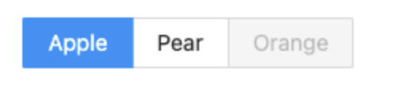

## Homework 3

In this assignment we will start to use React components. The goal of this assignment is to compose generic smaller components into larger more complex components. You will have to think about the information passed (props) from the larger parent components down to their child components. The components we will be creating are a login form, pager, and radio buttons. Below are some examples of how these might look:

  1. Login form example 
  
  

  2. Pager example
  
  

  3. Radio buttons example
  
  


## Deliverables

1. Layout the login form, pager, and radio buttons by composing generic components (I see 2-3 generic components you could make) that will be located in `src/components`.
2. Figure out what props you want to pass down to each component. Example: let's say we created a button component some, but not limited to, of the props that I might pass down could be a enable/disable flag, a way to change the color, and a button size. 
3. Feel free to add custom styling any new generic components you want.
4. For generic components that are taking event handlers (e.g. `onClick`, `onChange`, etc...), you are going to want to use `console.log` in the parent component so that you can see if your event is firing. Example: 
```
const Input = ({ onChange }) => {
  return <input type="text" onChange={e => onChange(e.target.value)} />
}

const SomeComponentThatUsesInput = () => {
  return <div>
    <Input onChange={v => console.log(`Hello from App - Input Value is: ${v}`)}/>
  </div>
}
```
6. **Deploy your app using whatever method you want (e.g. Github Pages, AWS, ect) and insert the url here: [Homework 3: Generic Components](https://main.d21nn8135ep6f8.amplifyapp.com/)**

## Bonus

:white_check_mark: Pager: If you have hardcoded a pager that works 1 to 10, then how might we modify it to be a bit more generic? What props can I pass in that will make the component more configurable?
- My pager component takes in your desired number of pages as a prop. 

:white_check_mark: Radio buttons: If you hardcoded "Apple", "Pear", and "Orange", then how might you modify it to take in an array of button configurations? What information might we need to determine if a button is active? 
- My radio button component takes in a 2-dimensional array of options. Each nested array's first element is the actual radio option; the second element is true or false —— disabling the option button if true. 

## Some notes

I have used state to keep track of and update some variables, like the current button selection, in my Pager and RadioButtons components. I tried looking up crash courses on state management but I was rather overwhelmed; most of the tutorials were on hooks and functional components. 

So, I modeled my solutions after this [example from StackOverflow](https://stackoverflow.com/questions/54310548/how-to-highlight-selected-button-in-react/54310960) of using state. Hope it’s alright! I was very eager to keep track of the button selection and couldn’t think of any other method to search for! 

## How to run the project

It is required that you have `node` and `npm` installed. In the project directory, you will run:

`npm i && npm start`

The app will start in the development mode. Open [http://localhost:4000](http://localhost:4000) to view it in the browser. The page will reload if you make edits. You will also see any lint errors in the console.
